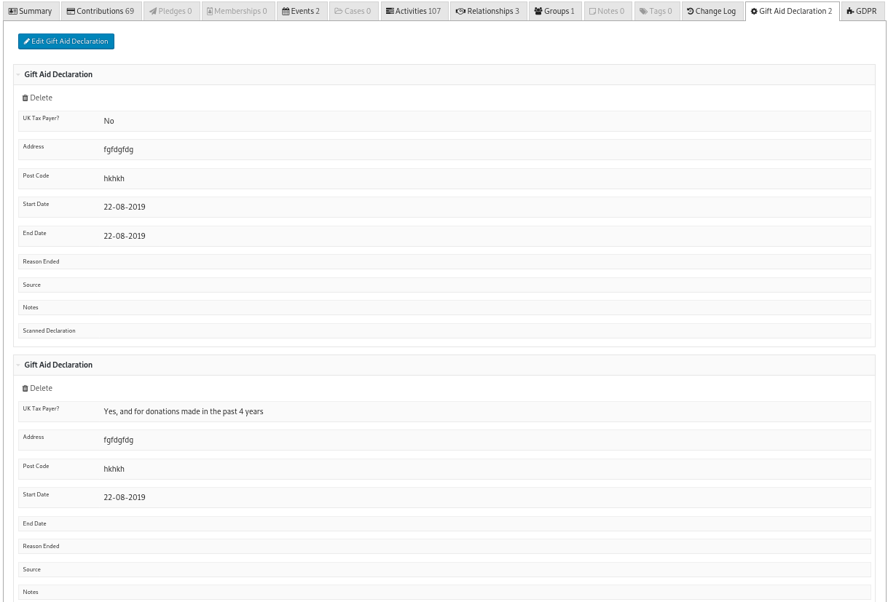

# The Gift Aid Declaration

On install, a "Gift Aid" profile is created for you.
If you add this to a contribution page the user can make a gift aid declaration:

It will then appear on the contact record:

## Declaration Fields

### Eligible for Gift Aid

#### Yes, and for donations made in the past 4 years

The donor has declared that gift aid can be claimed on all eligible contributions today, in the future AND going back 4 years from today.

#### Yes, today and in the future

The donor has declared that gift aid can be claimed on all eligible contributions today and in the future.

#### No

The donor has declared that gift aid can NOT be claimed on eligible contributions today and in the future.

### Address / Postcode

- The contact "Primary" address is used.
- It is formatted and filtered according to HMRC rules and then copied to the declaration automatically.

### End Date

The *current* declaration represents the current status and will not have an end date set. This applies even if the
declaration is "No" - because it will represent a time period between `start_date`/`end_date` where the contact was not eligible.

### Source

When updated by admin the source field can be filled in. If updating via a contribution/registration form the source will
normally be set to the title of that form.

## Creating/Updating Declarations

- Declarations can be entered manually by admin staff on the contact record if they have received them from the donor.
- Declarations can be entered by the donor if the "Eligible for Gift Aid" field is provided on the contribution/registration page.
A default profile is configured in CiviCRM that can be included.

### Transitioning from one type to another

#### No existing declaration

A new declaration is setup with start date today and "Eligible for Gift Aid" set to whatever was selected on the form.

#### Existing "No" declaration

If the new declaration is "Yes and past 4 years" or "Yes":

1. The existing "No" declaration end date is set to the new declaration's start date (e.g. today).

2. A new declaration is created with start date set to the new declaration's start date (e.g. today).

If the new declaration is "No" then no changes are made.

#### Existing "Yes and past 4 years"/"Yes" declaration

If the new declaration is "No":

1. The existing declaration end date is set to the new declaration's start date and its "Reason Ended" field is set to "Contact Declined".

2. A new declaration is created with start date set to the new declaration's start date and eligible = "No".

If the new declaration is "Yes and past 4 years" and the existing declaration is "Yes":

1. If the start date of the existing declaration is greater than 4 years ago no changes are made.

2. If the start date of the existing declaration is less than 4 years ago the start date is changed today (*not* the new declaration's start date) and contributions in the past 4 years will become eligible for submitting to HMRC.

If the new declaration is "Yes" and the existing declaration is "Yes" or "Yes and past 4 years" no changes are made. As the donor has previously stated "Yes and past 4 years" it is up to the donor to inform the organisation if that declaration was made in error.
